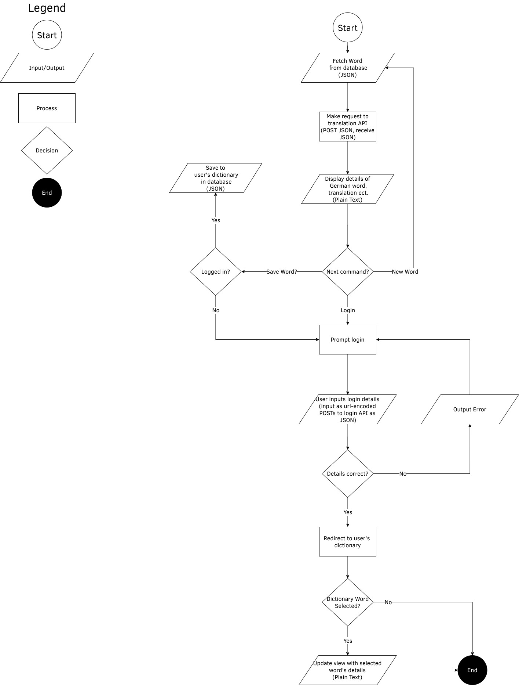
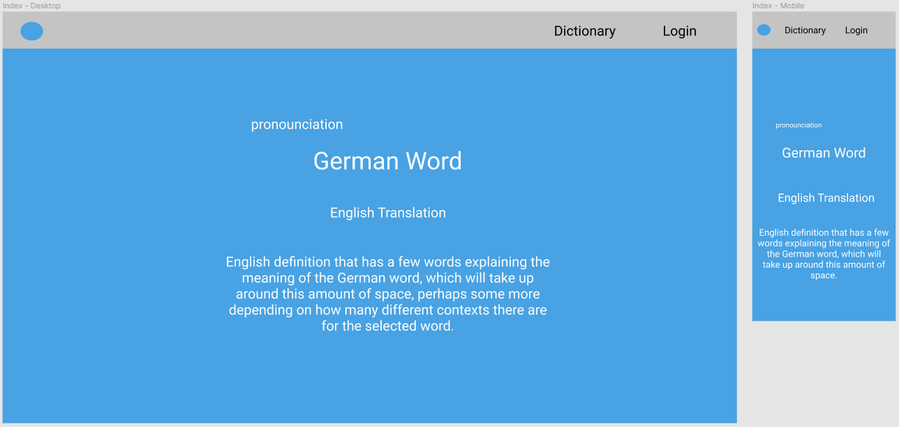
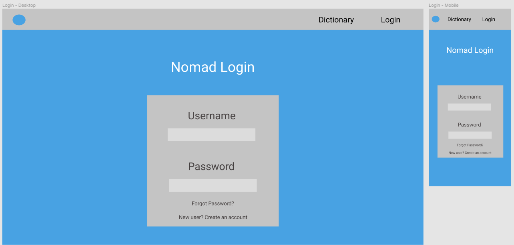
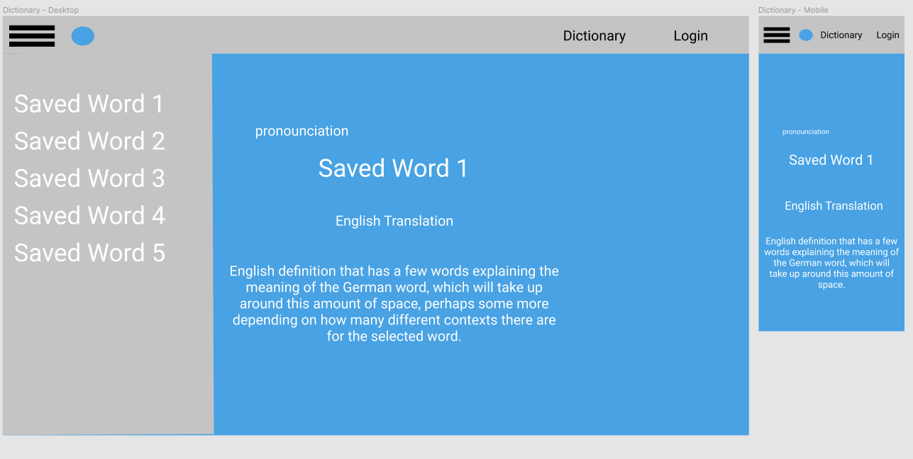
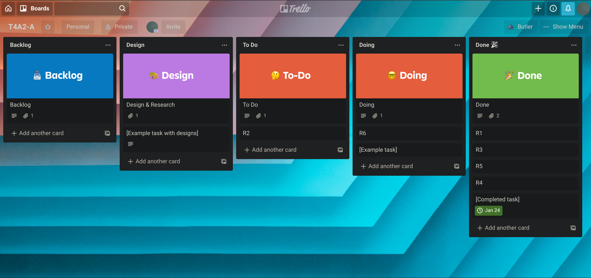
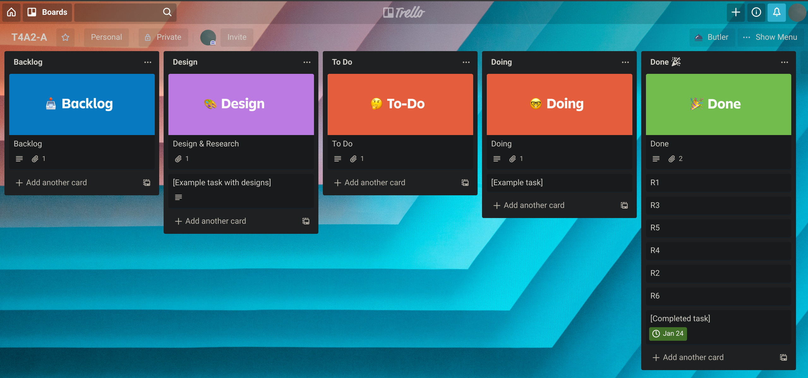

# T4A2-A

## Foreword

**THIS PROJECT IS CURRENTLY POSTPONED**

### Why is this project postponed?

I struggled a lot with motivation during the making of this project, and I think it's best that I come back to it another time, as it's currently holding me back from learning new things.

It's pretty close to finished, I just need to add one last feature, but I'm much more interested in learning some other technologies at the moment, and I'm going to fall behind if I don't.

### Where are your commits?

I'm working locally and deploying directly to Heroku using `heroku-postbuilds`, without using GitHub as a middleman. Otherwise, I end up committing my GCP key, and that's no good. This is why there's a giant gap in my commits.

## Description

### Purpose

The purpose of this project, is to provide the user with a German word upon visiting the page, the word will provided alongside other details such as the definition, pronunciation, and English equivalent.

The user can then choose to save the word to their 'dictionary', which will allow them to revisit the word at a later time. 

### Functionality/Features

- Display a word upon visiting page/clicking 'New Word' button.

  Result includes:

  - Pronunciation
  - Definition
  - English translation

- Save a word to 'dictionary'

  - Revisit the word at a later time
  - Drill all words in dictionary
  - Saved to each user

- Login to access dictionary and features

### Target Audience

The target audience for this project is any English speakers who would like to improve their vocabulary and/or understanding of German words, in a way that is less studious than reading textbooks for hours, but rather could add a word a day to someone's vocabulary by simply visiting the page.

It is likely that companies or educational facilities would adopt this project as a free, open-source method of improving language skills, for employees, or for students.

### Tech Stack

- Node
  - Express
  - React
- MongoDB

## Dataflow Diagram

## Application Architecture Diagram

## User Stories

| Story                                                        | Implementation                                               |
| ------------------------------------------------------------ | ------------------------------------------------------------ |
| As a German learner, I want to learn a new word everyday, so that I can improve my vocabulary. | Index page, word generation, translation, definition and pronunciation. |
| As a teacher, I want my students to improve their vocabulary and understanding of the German language by reinforcing their knowledge of specific words they've chosen to learn, so that they can do better in class reading tasks. | Dictionary save feature.                                     |
| As a user, I want to log in and view my saved words, so that I can practice them. | Login and dictionary pages.                                  |

## Wireframes

### Index Page Wireframe

### Login Page Wireframe

### Dictionary Page Wireframe

## Trello Board

Here's what my Trello board looked like before starting the project, it's set out in an agile style.

Here's what the board looked like a bit later on in the project.

Here's what my board looks like at the end of the project

## User Testing

### Development Stage

| Tester | Environment | Feature    | Expected Outcome                                             | Actual Outcome                                               |
| ------ | ----------- | ---------- | ------------------------------------------------------------ | ------------------------------------------------------------ |
| Joseph | Development | Login      | I expect to be able to click a login button, and be redirected to a login page, where I can enter my credentials and be authenticated. | I am able to click a login button, enter my credentials, and be authenticated. |
| Liam   | Development | Home Page  | I expect to visit the home page, and see a German word, with it's pronunciation, definition and translation. | I am able to visit the home page, and see a German word, with it's pronunciation, definition and translation. |
| Oliver | Development | Dictionary | I expect to be able to login, and then view the words that I have saved, so I can study them at a later date. | I can login, and save words, but I'm unable to view them.    |

### Production Stage

| Tester | Environment | Feature    | Expected Outcome                                             | Actual Outcome                                               |
| ------ | ----------- | ---------- | ------------------------------------------------------------ | ------------------------------------------------------------ |
| Joseph | Production  | Login      | I expect to be able to click a login button, and be redirected to a login page, where I can enter my credentials and be authenticated. | I am able to click a login button, enter my credentials, and be authenticated. |
| Liam   | Production  | Home Page  | I expect to visit the home page, and see a German word, with it's pronunciation, definition and translation. | I am able to visit the home page, and see a German word, with it's pronunciation, definition and translation. |
| Oliver | Production  | Dictionary | I expect to be able to login, and then view the words that I have saved, so I can study them at a later date. | I can login, and save words, then visit my dictionary to study them in further detail. |

